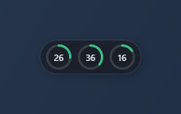
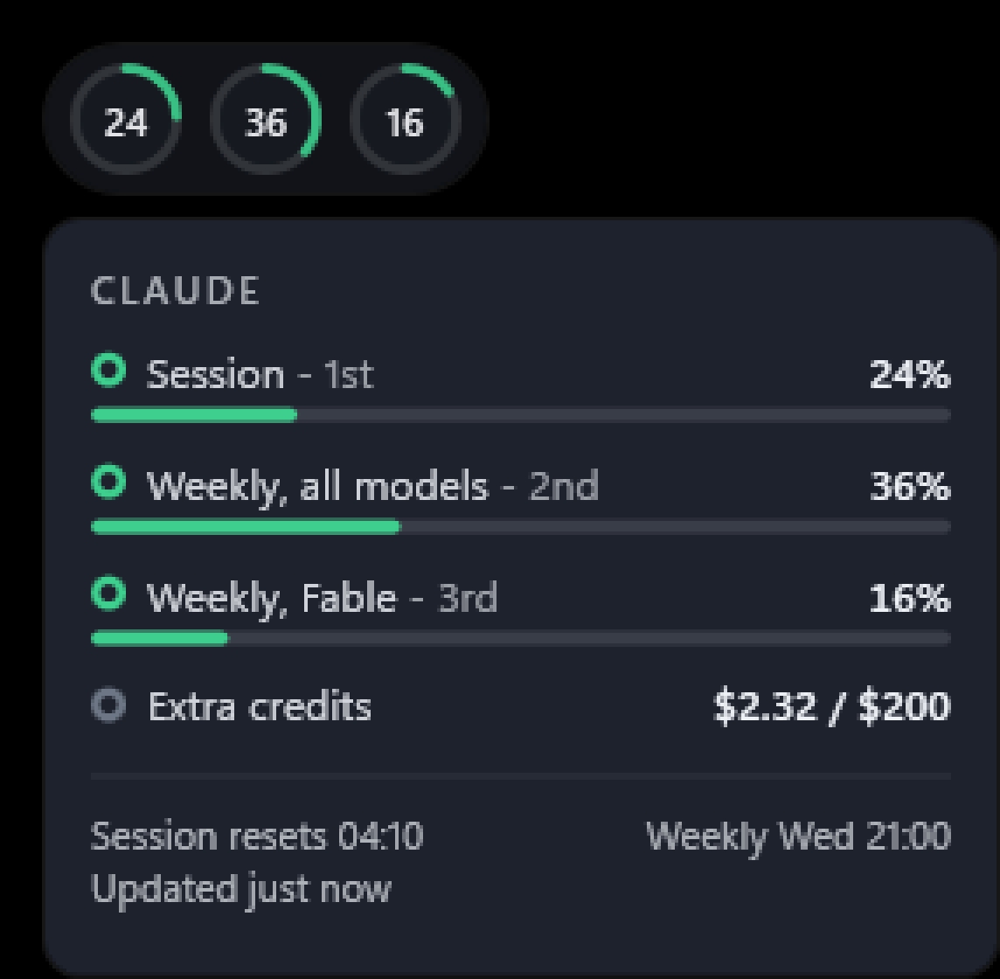
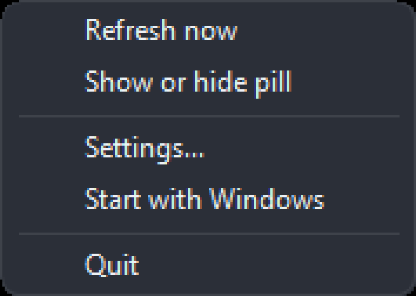
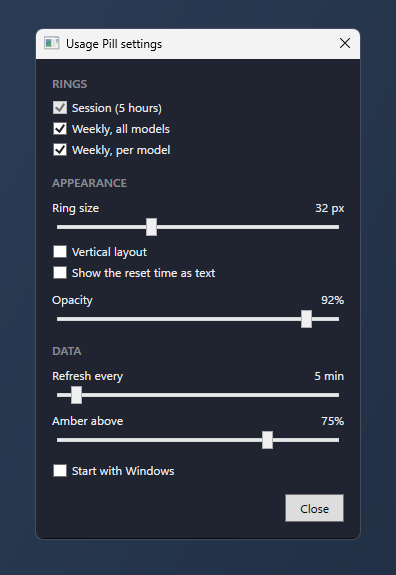
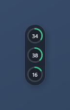

# Usage Pill

[](https://github.com/kcao-gss/usage-pill/actions/workflows/ci.yml)
[](https://github.com/kcao-gss/usage-pill/actions/workflows/release.yml)



Usage Pill is a small always-on-top Windows pill that shows your Claude subscription
usage as three ring gauges. It sits on your desktop, polls the same numbers the
`/usage` command in Claude Code shows, and stays out of the way otherwise: no
window chrome, no taskbar entry, click-through avoided but never focus-stealing.
It picks up your Claude Code login from Windows and from WSL, whichever signed in
last.

## Download

Grab the latest build from the [Releases page](https://github.com/kcao-gss/usage-pill/releases).
Two zips are published for every release:

| Download | Size | Needs |
|---|---|---|
| `UsagePill-<version>-win-x64-self-contained.zip` | about 68 MB | nothing, it runs as-is |
| `UsagePill-<version>-win-x64-framework-dependent.zip` | under 1 MB | the [.NET 8 Desktop Runtime](https://dotnet.microsoft.com/download/dotnet/8.0/runtime) |

Unzip anywhere and run `UsagePill.exe`. Checksums for both are in `SHA256SUMS.txt`
on the release. Requires Windows 10 or 11 on x64, and Claude Code signed in on the
same machine, on Windows or in WSL.

## What the rings mean

Left to right (or top to bottom in vertical layout): the 5 hour session window, the
weekly all-model limit, and the weekly per-model limit. The number inside each ring
is the percentage **used**, not remaining.

Each ring's colour comes from its own value:

- **Green** below the amber threshold (75% by default).
- **Amber** at or above the threshold.
- **Red** when the API itself reports that limit as critical, regardless of the
  threshold.
- **Grey** when a ring has no data or is switched off.

Every ring except the session ring can be switched off individually in Settings; the
session ring is always shown.

## Getting it running

You need the .NET 8 Windows SDK. From WSL, `build.sh` wraps the Windows SDK so
builds run against a real Windows path:

```bash
./build.sh build     # compile
./build.sh test      # run unit tests
./build.sh run       # run the app
./build.sh publish   # produce UsagePill.exe
```

`./build.sh publish` produces a framework-dependent build at
`src/UsagePill/bin/Release/net8.0-windows/win-x64/publish/UsagePill.exe`. It still
needs the Windows .NET 8 desktop runtime installed to run.

## How it gets the data

Usage Pill reads the access token Claude Code stores in its credentials file and calls
`https://api.anthropic.com/api/oauth/usage`, the same endpoint behind Claude Code's
`/usage` command. It only reads that file: it never writes to it and never refreshes
the token itself.

The request identifies itself as `claude-code/<version>`, because the endpoint picks a rate
limit bucket from that header. A client that does not name itself Claude Code is limited after
a handful of calls and then stays limited for hours, which would freeze the rings on stale
numbers.

It looks in every place you can be signed in on this machine:

- `%USERPROFILE%\.claude\.credentials.json`, the Windows login.
- `\\wsl.localhost\<distro>\home\<user>\.claude\.credentials.json` and the `root`
  equivalent, for each installed WSL distribution. Distribution names come from the
  registry, so no `wsl.exe` call is needed. Docker's internal distributions are skipped.

The token with the latest expiry wins, because that file belongs to the Claude Code
that signed in or refreshed most recently. A token the endpoint has rejected drops to
the bottom of that order, so another Claude Code on the machine takes over instead of
the pill sending the same dead token again. The pill then keeps reading that one file
every poll, which costs one file read and never wakes a stopped distribution. It looks
at all the locations again only at startup, when the chosen file stops being readable,
and when the usage endpoint rejects the token.

If you have not used Claude Code for several hours, the token expires. The usage
endpoint then rejects the request with 401 or 403, the session ring turns amber and
shows `!`, and the tooltip and detail card both read "Login expired - start Claude
Code to refresh". Start Claude Code again, on Windows or in WSL, to refresh the token;
no restart is needed. After a rejected token the pill retries in 15 seconds and doubles
that wait up to your poll interval, so the rings usually go live within 15 seconds of
the refresh.

## Using it

- **Left click** the pill to open the detail card: all three limits with their
  meters, extra usage credits, and reset times.
- **Right click** the pill (or the tray icon) for the menu: refresh now, show or
  hide the pill, settings, start with Windows, and quit.
- **Drag** the pill to move it. Release near a screen edge or corner and it snaps
  flush. The position is saved.
- The **tray icon** draws the session percentage, so you can hide the pill and
  still see your session usage at a glance.





## Settings

Open Settings from the tray menu ("Settings...") or edit
`%APPDATA%\usage-pill\settings.json` directly.



- **Rings**: which of the two optional rings to show (weekly, all models and
  weekly, per model). The session ring cannot be turned off.
- **Ring size**: 24 to 48 px, default 32.
- **Vertical layout**: stacks the rings top to bottom instead of side by side.
- **Show the reset time as text**: adds the session reset time next to (or below)
  the rings.
- **Opacity**: 30 to 100%, default 92%.
- **Refresh every**: 1 to 60 minutes, default 5.
- **Amber above**: the warning threshold, 1 to 100%, default 75%.
- **Start with Windows**: adds or removes a shortcut in your Startup folder. No
  registry writes.

All numeric settings are clamped to their valid range when loaded, so an edited or
corrupted `settings.json` cannot put the app in a broken state.

`settings.json` looks like this:

```json
{
  "pollIntervalMinutes": 5,
  "rings": { "session": true, "weeklyAll": true, "weeklyPerModel": true },
  "ringSizePx": 32,
  "orientation": "horizontal",
  "showResetTimeText": false,
  "warnThresholdPercent": 75,
  "opacity": 0.92,
  "window": { "left": 40, "top": 40 },
  "startWithWindows": false
}
```

The ring size range and the vertical layout, side by side:




## When things go wrong

| What you see | What it means |
|---|---|
| All rings grey and empty, `--` inside | No poll has completed yet. Normal for the first few seconds after startup. |
| All rings grey and empty, `-` inside, tooltip "Claude Code not logged in" | No credentials file on Windows or in any WSL distribution could be read. Sign in with Claude Code. |
| First ring amber and full with `!`, others grey, tooltip "Login expired - start Claude Code to refresh" | The access token has expired. Start Claude Code to refresh it, then wait for the next poll. |
| Last good values shown, capsule dimmed to 60% opacity, grey dot on the first ring, tooltip "Rate limited, retrying at HH:MM" | The usage endpoint returned 429. The poller backs off and retries automatically. |
| Last good values shown, capsule dimmed to 60% opacity, grey dot on the first ring, tooltip with an error summary | A network error or a 5xx response. The poller backs off and retries automatically. |

A failed poll never crashes the app and never blocks the UI; it just keeps showing
the last good values until the next successful poll.

## Design documents

- Spec: `docs/superpowers/specs/2026-09-14-usage-pill-design.md`
- Visual reference: `docs/superpowers/specs/2026-09-14-usage-pill-ui.html`
- Implementation plan: `docs/superpowers/plans/2026-09-14-usage-pill.md`
