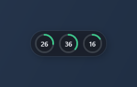
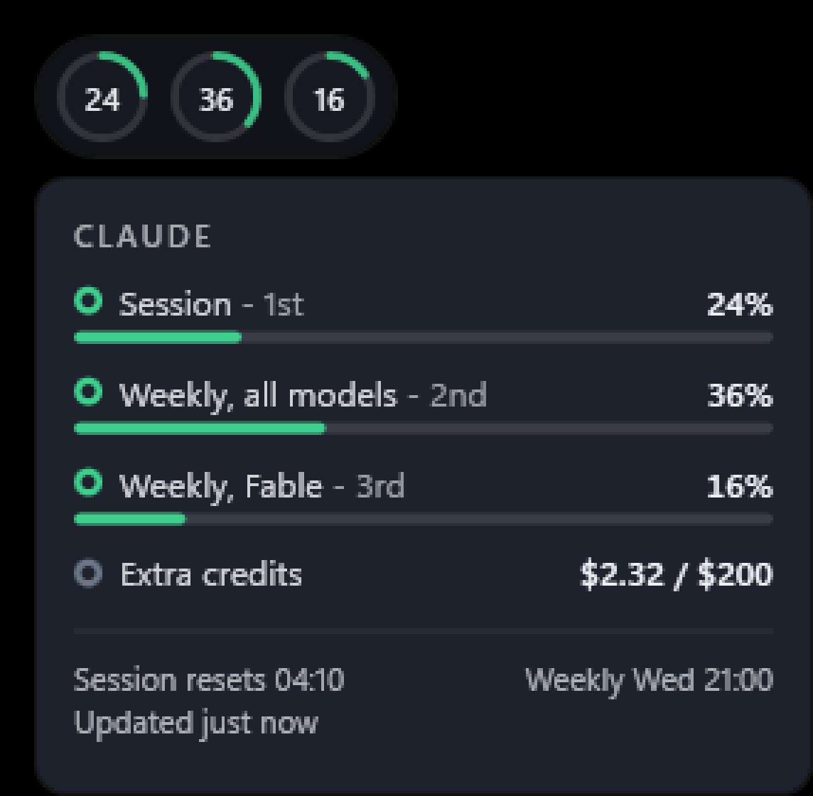
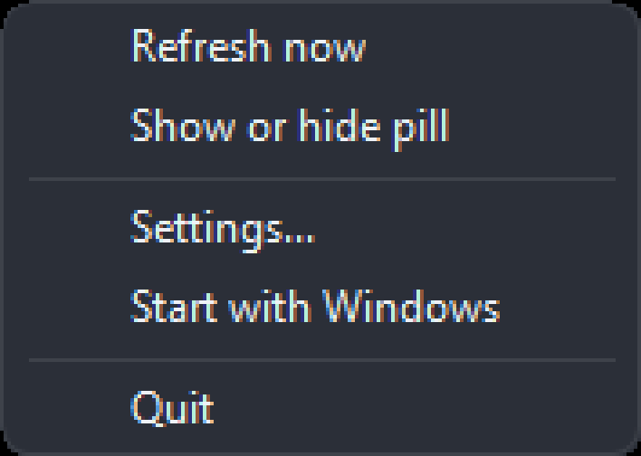
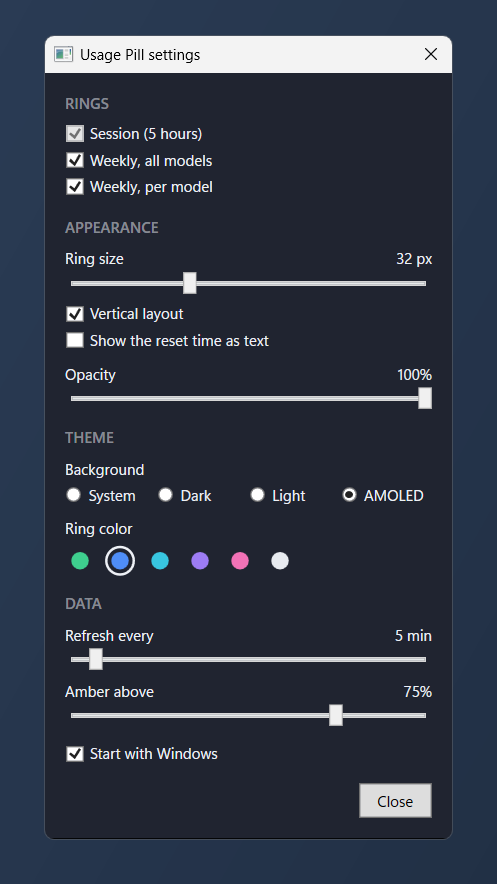
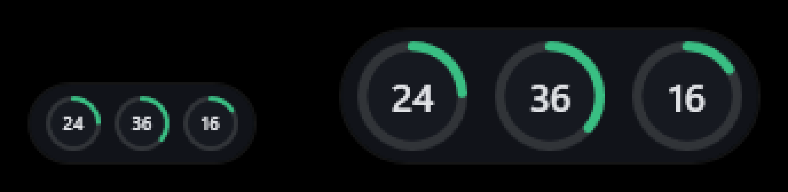
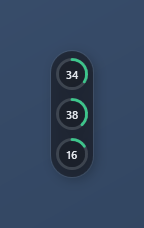

# Usage Pill

[](https://github.com/kcao-gss/usage-pill/actions/workflows/ci.yml)
[](https://github.com/kcao-gss/usage-pill/actions/workflows/release.yml)



Usage Pill is a small always-on-top Windows pill that shows your Claude subscription
usage as three ring gauges. It sits on your desktop, polls the same numbers the
`/usage` command in Claude Code shows, and stays out of the way otherwise: no
window chrome, no taskbar button, no Alt+Tab entry, click-through avoided but
never focus-stealing. It picks up your Claude Code login from Windows and from
WSL, whichever signed in last.

## Download

Grab the latest build from the [Releases page](https://github.com/kcao-gss/usage-pill/releases).
Two zips are published for every release:

| Download | Size | Needs |
|---|---|---|
| `UsagePill-<version>-win-x64-self-contained.zip` | about 68 MB | nothing, it runs as-is |
| `UsagePill-<version>-win-x64-framework-dependent.zip` | under 1 MB | the [.NET 8 Desktop Runtime](https://dotnet.microsoft.com/download/dotnet/8.0/runtime) |

Unzip anywhere and run `UsagePill.exe`. Checksums for both are in `SHA256SUMS.txt`
on the release. Requires Windows 10 or 11 on x64, and Claude Code signed in on the
same machine, on Windows or in WSL.

## What the rings mean

Left to right (or top to bottom in vertical layout): the 5 hour session window, the
weekly all-model limit, and the weekly per-model limit. The number inside each ring
is the percentage **used**, not remaining.

Each ring's colour comes from its own value:

- **Your ring colour** (green by default, see **Ring color** under Settings) below the
  amber threshold (75% by default).
- **Amber** at or above the threshold.
- **Red** when the API itself reports that limit as critical, regardless of the
  threshold.
- **Grey** when a ring has no data or is switched off.

Every ring except the session ring can be switched off individually in Settings; the
session ring is always shown.

## Getting it running

You need the .NET 8 Windows SDK. From WSL, `build.sh` wraps the Windows SDK so
builds run against a real Windows path:

```bash
./build.sh build     # compile
./build.sh test      # run unit tests
./build.sh run       # run the app
./build.sh publish   # produce UsagePill.exe
```

`./build.sh publish` produces a framework-dependent build at
`src/UsagePill/bin/Release/net8.0-windows/win-x64/publish/UsagePill.exe`. It still
needs the Windows .NET 8 desktop runtime installed to run.

## How it gets the data

Usage Pill reads the access token Claude Code stores in its credentials file and calls
`https://api.anthropic.com/api/oauth/usage`, the same endpoint behind Claude Code's
`/usage` command. When that token has expired, the pill renews it with the refresh token
in the same file and writes the new tokens back, the way Claude Code does. See
[When the login expires](#when-the-login-expires).

The request identifies itself as `claude-code/<version>`, because the endpoint picks a rate
limit bucket from that header. A client that does not name itself Claude Code is limited after
a handful of calls and then stays limited for hours, which would freeze the rings on stale
numbers.

It looks in every place you can be signed in on this machine:

- `%USERPROFILE%\.claude\.credentials.json`, the Windows login.
- `\\wsl.localhost\<distro>\home\<user>\.claude\.credentials.json` and the `root`
  equivalent, for each installed WSL distribution. Distribution names come from the
  registry, so no `wsl.exe` call is needed. Docker's internal distributions are skipped.

The token with the latest expiry wins, because that file belongs to the Claude Code
that signed in or refreshed most recently. A token that is past its own expiry, or that
the endpoint has rejected, drops to the bottom of that order, so another Claude Code on
the machine takes over. The pill never sends a token the endpoint has already rejected:
the endpoint answers a dead token that keeps asking with 429, and that 429 would hold
the pill off for up to an hour. A rejected token is sent again only once something
replaces it with a new one.
Once it has chosen, the pill keeps reading that one file every poll, which costs one file read and never
wakes a stopped distribution. It looks at all the locations again only at startup, when
the chosen file stops being readable, when its token passes its expiry, when the usage
endpoint rejects the token, and when the token lacks the `user:profile` scope.

A file whose token is empty does not count as a login at all. A token without the
`user:profile` scope, which the usage endpoint requires, ranks below every other token,
even an expired one: a refresh renews an expired token, but no refresh adds a missing
scope.

If no token on the machine carries the `user:profile` scope, the pill does not call the
endpoint at all. The session ring turns amber and shows `!`, and the tooltip and detail card
read "Login lacks usage access - run /login in Claude Code". The same happens when the
endpoint itself answers 403 naming that scope. Restarting Claude Code does not fix this;
signing in again with `/login` does, and the pill picks the new token up on its next retry.

### When the login expires

The access token expires after about eight hours. While Claude Code runs, it renews the
token in the credentials file before then. When no program renews it, the pill does:

- It waits until the token is past its expiry. It never renews early, so a running
  Claude Code, or another tool such as the Raycast Agent Usage extension, gets to renew
  first.
- It renews only the file it reads now, and it sends the refresh token to
  `https://platform.claude.com/v1/oauth/token` with Claude Code's client ID. That request
  names itself `usage-pill/<version>`: the token endpoint answers a `claude-code/` agent
  with 429.
- A renewal can replace the refresh token and make the old one invalid. So the pill writes
  the new tokens only while the file still holds the tokens it started from. If another
  program renewed the file in the meantime, the pill keeps that program's tokens and
  uses them.
- It changes only `accessToken`, `refreshToken` and `expiresAt`, and keeps every other
  field. It writes in place, so the file keeps its owner, its permissions and, in WSL,
  its `600` mode. A running Claude Code sees the change and uses the new token.

The session ring turns amber and shows `!`, and the tooltip and detail card read "Login
expired - start Claude Code to refresh", only when the pill cannot renew the token: the
file has no refresh token, the pill cannot write the file, or the token endpoint refused
the refresh token. The pill does not send a refused refresh token again. A token that the
usage endpoint rejects with 401 or 403 also shows this state. Start Claude Code, on
Windows or in WSL, and sign in with `/login` if it asks. No restart is needed: while the
login is expired the pill rereads the credentials file in 15 seconds and doubles that wait
up to your poll interval, so the rings go live within one poll interval of the new login.

## Using it

- **Left click** the pill to open the detail card: all three limits with their
  meters, extra usage credits, and reset times.
- **Right click** the pill (or the tray icon) for the menu: refresh now, show or
  hide the pill, settings, start with Windows, and quit. Refresh now does nothing within
  30 seconds of the previous poll or while a rate limit is being waited out: the endpoint
  answers a few requests within seconds with 429 and then refuses every request for about
  five minutes.
- **Drag** the pill to move it. Release near a screen edge or corner and it snaps
  flush. The position is saved.
- The **tray icon** draws the session percentage, so you can hide the pill and
  still see your session usage at a glance.





## Settings

Open Settings from the tray menu ("Settings...") or edit
`%APPDATA%\usage-pill\settings.json` directly.



- **Rings**: which of the two optional rings to show (weekly, all models and
  weekly, per model). The session ring cannot be turned off.
- **Ring size**: 24 to 48 px, default 32.
- **Vertical layout**: stacks the rings top to bottom instead of side by side.
- **Show the reset time as text**: adds the session reset time next to (or below)
  the rings.
- **Opacity**: 30 to 100%, default 92%. Applies on top of the background, so set it to
  100% for a pitch black AMOLED pill.
- **Background**: System (default) follows the Windows light or dark app theme; Dark
  and Light pin one; AMOLED makes the pill and the detail card solid black.
- **Ring color**: Green (default), Blue, Cyan, Violet, Pink or White. It replaces only
  the normal colour: amber above the threshold and red for a critical limit still win,
  and the tray icon and the detail card's meters use it too. Any other `#RRGGBB` works
  as `ringColor` in `settings.json`; an invalid value falls back to green.
- **Refresh every**: 1 to 60 minutes, default 5. A new interval counts from the last
  poll and never sends an extra request on its own: the pill polls at once only when
  the last poll is already older than the new interval, and a rate limit or login
  backoff in progress keeps its schedule.
- **Amber above**: the warning threshold, 1 to 100%, default 75%.
- **Start with Windows**: adds or removes a shortcut in your Startup folder. No
  registry writes.

All numeric settings are clamped to their valid range when loaded, so an edited or
corrupted `settings.json` cannot put the app in a broken state.

`settings.json` looks like this:

```json
{
  "pollIntervalMinutes": 5,
  "rings": { "session": true, "weeklyAll": true, "weeklyPerModel": true },
  "ringSizePx": 32,
  "orientation": "horizontal",
  "showResetTimeText": false,
  "background": "system",
  "ringColor": "#3ECF8E",
  "warnThresholdPercent": 75,
  "opacity": 0.92,
  "window": { "left": 40, "top": 40 },
  "startWithWindows": false
}
```

The ring size range and the vertical layout, side by side:





## When things go wrong

| What you see | What it means |
|---|---|
| All rings grey and empty, `--` inside | No poll has completed yet. Normal for the first few seconds after startup. |
| All rings grey and empty, `-` inside, tooltip "Claude Code not logged in" | No credentials file on Windows or in any WSL distribution could be read. Sign in with Claude Code. |
| First ring amber and full with `!`, others grey, tooltip "Login expired - start Claude Code to refresh" | The access token has expired and the pill could not renew it: the file has no refresh token, the pill cannot write the file, or the refresh token was refused. Start Claude Code, run `/login` if it asks, then wait for the next poll. |
| First ring amber and full with `!`, others grey, tooltip "Login lacks usage access - run /login in Claude Code" | The token lacks the `user:profile` scope the usage endpoint requires. Run `/login` in Claude Code to sign in again. |
| Last good values shown, capsule dimmed to 60% opacity, grey dot on the first ring, tooltip "Rate limited, retrying at HH:MM" | The usage endpoint returned 429. The poller waits as long as the endpoint's `Retry-After` asks, or backs off from 5 minutes up to an hour without one, and retries automatically. Refresh now does not cut the wait short. |
| Last good values shown, capsule dimmed to 60% opacity, grey dot on the first ring, tooltip with an error summary | A network error or a 5xx response. The poller backs off and retries automatically. |

A failed poll never crashes the app and never blocks the UI; it just keeps showing
the last good values until the next successful poll.

## Design documents

- Spec: `docs/superpowers/specs/2026-09-14-usage-pill-design.md`
- Visual reference: `docs/superpowers/specs/2026-09-14-usage-pill-ui.html`
- Implementation plan: `docs/superpowers/plans/2026-09-14-usage-pill.md`
